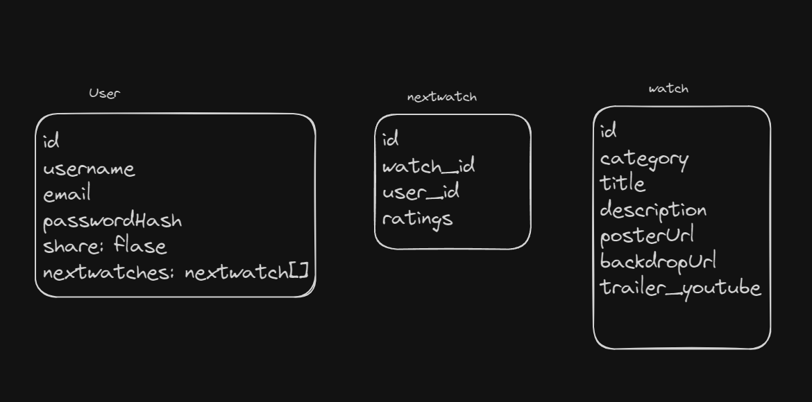

### Data



### Endpoints

**GET /api/watches**

- Get a list of upcoming tv/movie

Response:

```
[
  {
    "title": "No Way Up",
    "description": "Characters from different backgrounds are thrown together when the plane they're travelling on crashes into the Pacific Ocean. A nightmare fight for survival ensues with the air supply running out and dangers creeping in from all sides.",
    "posterUrl": "https://image.tmdb.org/t/p/w500/hu40Uxp9WtpL34jv3zyWLb5zEVY.jpg",
    "backdropUrl": "https://image.tmdb.org/t/p/w500/4woSOUD0equAYzvwhWBHIJDCM88.jpg",
    "trailer_youtube": "e1k1PC0TtmE",
    "category": "Movie",
    "id": "663142f650b4130d190f78fa"
  },
  ...
]
```

**GET /api/watches/:id**

- Get tvs/movies/animes by id

Response:

```
{
  "title": "No Way Up",
  "description": "Characters from different backgrounds are thrown together when the plane they're travelling on crashes into the Pacific Ocean. A nightmare fight for survival ensues with the air supply running out and dangers creeping in from all sides.",
  "posterUrl": "https://image.tmdb.org/t/p/w500/hu40Uxp9WtpL34jv3zyWLb5zEVY.jpg",
  "backdropUrl": "https://image.tmdb.org/t/p/w500/4woSOUD0equAYzvwhWBHIJDCM88.jpg",
  "trailer_youtube": "e1k1PC0TtmE",
  "category": "Movie",
  "id": "663142f650b4130d190f78fa"
}
```

**GET /api/nextwatches**

- Get all nextwatches for an existing user

Parameters:

- token in the request header: JWT used to authenticate user

Response:

```
[
  {
    "watch_id": {
      "title": "Kung Fu Panda 4",
      "category": "Movie",
      "id": "663142f650b4130d190f78fe"
    },
    "user_id": "6637a5c1aea8aae27af799a2",
    "rating": 0,
    "id": "6637a89e13d4accbc68d3013"
  },
  ...
]
```

**GET /api/nextwatches/:id**

- get one nextwatch based on the id for an existing user

Parameters:

- id: nextwatch id
- token in the request header: JWT used to authenticate user

Response:

```
[
  {
    "watch_id": "663142f650b4130d190f78fe",
    "user_id": "6637a5c1aea8aae27af799a2",
    "rating": 0,
    "id": "6637a89e13d4accbc68d3013"
  }
]
```

**GET /api/nextwatches/watch/:watchId**

- get one nextwatch based on the watch_id for an existing user

Parameters:

- id: nextwatch id
- token in the request header: JWT used to authenticate user

Response:

```
{
  "watch_id": "663142f650b4130d190f78fe",
  "user_id": "6637a5c1aea8aae27af799a2",
  "rating": 0,
  "id": "6637a89e13d4accbc68d3013"
}
```

**POST /api/nextwatches**

- create one nextwatch based on the id for an existing user

Parameters:

- token: JWT of the logged in user
- watch_id: watch id
- user_id: user id

Response:

```

{
  "watch_id": "663142f650b4130d190f790c",
  "user_id": "6637a5c1aea8aae27af799a2",
  "rating": 0,
  "id": "663a13c829ee1a3c92a4bc8e"
}
```

**PUT /api/nextwatches/:id**

- upate the rating based on the id for an existing user

Parameters:

- id: nextwatch id
- token: JWT of the logged in user
- rating: Number between 1 to 10

Response:

```
{
  "message": "Update the rating successfully"
}
```

**DELETE /api/nextwatches/:id**

- delete one based on the id for an existing user

Parameters:

- id: nextwatch id
- token: JWT of the logged in user

**POST /api/users/signup**

- Add a user account

Parameters:

- username: user's uername
- email: User's email
- password: User's provided password

Response:

```
{
  "username": "vivi",
  "email": "viv@gmail.com",
  "share": false,
  "nextwatches": [],
  "id": "66398c6623c43faf6fdc786b"
}

```

**POST /api/users/login**

- Login a user

Parameters:

- email: User's email
- password: User's provided password

Response:

```
{
    "token": "seyJhbGciOiJIUzI1NiIsInR5cCI6IkpXVCJ9.eyJzdWIiOiIxMjM0NTY3ODkwIiwibmFtZSI6I..."
}
```

**GET /api/users**

- fetch a user information

Parameters:

- token: JWT of the logged in user

Response:

```
{
  "username": "lulu",
  "email": "lulu@icloud.com",
  "share": true,
  "nextwatches": [
  ],
  "id": "6637f4d7e02e5ed158bc7061"
}
```

**GET /api/users/nextwatches**

- fetch the nextwatches for a logged in user

Parameters:

- token: JWT of the logged in user

Response:

```

[
  {
    "watch_id": "663142f650b4130d190f78fb",
    "user_id": "6637f4d7e02e5ed158bc7061",
    "rating": 8,
    "id": "663824b82b1a0ed71fa38cbd"
  },
  ...
]
```

**PUT /api/users/share**

- update the share status of a nextwatch list for a logged in user

Parameters:

- token: JWT of the logged in user

Response:

```
{
  "message": "Update share successfully"
}
```

**GET /api/users/nextwatches/allshared**

- get all the shared nextwatch lists of all users

Parameters:

- token: JWT of the logged in user

Response:

```
[
  {
    "id": "6637a5c1aea8aae27af799a2",
    "username": "fangfang",
    "nextwatches": [
      {
        "title": "Kung Fu Panda 4",
        "watch_id": "663142f650b4130d190f78fe",
        "posterUrl": "https://image.tmdb.org/t/p/w500/kDp1vUBnMpe8ak4rjgl3cLELqjU.jpg",
        "id": "6637a89e13d4accbc68d3013"
      },
      {
        "title": "Godzilla x Kong: The New Empire",
        "watch_id": "663142f650b4130d190f78fb",
        "posterUrl": "https://image.tmdb.org/t/p/w500/bQ2ywkchIiaKLSEaMrcT6e29f91.jpg",
        "id": "6637d22ea0a250992a988e84"
      }
    ]
  },
 ...
]
```

### Auth

- JWT auth
  - Backend auth is implemented and tested first
  - Store JWT in localStorage, remove when a user logs out
  - Add user states in showing different UI in places listed in mockups

## Roadmap

- Create server

  - express project with routing, with placeholder 200 responses

- Check TMDB APIs

- check the TMDB upcoming tvs/movies/animes data and what fields and values are available and decide what is needed

- Create script to fetch, sanitize and save the data to mongodb database, use it as the initial data

- Create client

  - react project with routes and boilerplate pages

- Deploy client and server projects so all commits will be reflected in production

- Feature: Home page / watchlistpage that lists all the new coming tvs/movies

  - Implement watchlistpage
  - Create GET /api/watches endpoint

- Feature: watchdetailspage

  - Implement watchdetailspage
  - Create GET /api/watches/:id

- Feature: add to nextwatch

  - Implement add to nextwatch
  - Create POST /api/nextwatches

- Feature: remove from nextwatch

  - Implement remove from nextwatch
  - Create DELETE /api/nextwatches/:id

- Feature: nextwatchpage

  - Implement nextwatchpage
  - Create GET /api/nextwatches
  - Implement update ratings
  - Create PUT /api/nextwatches/:id
  - Implement share function
  - Create PUT /api/users/share

- Feature: Share page

  - Implement nextwatchpage
  - Create GET /api/users/allshared

- Feature: Create account

  - Implement signup page + form
  - Create POST /users/signup endpoint

- Feature: Login

  - Implement login page + form
  - Create POST /users/login endpoint

- Feature: Implement JWT tokens

  - Server: Update expected requests / responses on protected endpoints
  - Client: Store JWT in local storage, include JWT on axios calls

- Bug fixes

- DEMO DAY

## Nice-to-haves

Your project will be marked based on what you committed to in the above document. Under nice-to-haves, you can list any additional features you may complete if you have extra time, or after finishing.

- includes testing like react testing
- deployment
- user's comments for each nextwatch list on the shared page
